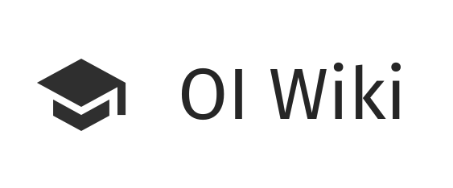

<p align="center">
  <a href="https://ng.oi-wiki.org">
    
  </a>
</p>

<h1 align="center">
  gatsby-oi-wiki
</h1>

正在开发中的基于 gatsby 的渲染框架。欢迎您点击下方链接入群并参与项目。

Demo: https://ng.oi-wiki.org/

TG 群：https://t.me/joinchat/GaEGzhcWGl8-1CSjdhi9kA

## 🚀 快速上手

1. 建立一个 Gatsby 站点

```zsh
# 使用本项目作为 starter 建立一个新的 Gatsby 站点
gatsby new my-wiki-starter https://github.com/OI-wiki/gatsby-oi-wiki
```

2. 开始开发

```zsh
# 进入刚才建立的文件夹并启动 develop 服务器
cd my-wiki-starter/
gatsby develop
```

3. 打开源代码并开始编辑！

你的站点已经在 `http://localhost:8000` 运行啦！

注意：你还会看到这样一个链接： `http://localhost:8000/___graphql` 。这是个可视化工具，来辅助你对数据库进行一些实验性的查询。点击 [Gatsby 教程](https://www.gatsbyjs.org/tutorial/part-five/#introducing-graphiql) 可以了解如何使用。

## 如何参与

一般情况下，你需要把本项目先 Fork 一份。

### 方法一：本地编写

在本地准备好 Git 和 Node.js（其中包含 npm）

```shell
# 只有 Windows 用户需要执行这一句，请务必在进行下列操作前在拥有管理员权限的窗口执行此项
# 该操作将执行20分钟甚至更多，期间可能会出现停在一个页面不动以及CPU飙升的情况，属正常现象
npm install -g windows-build-tools
git clone https://github.com/{你的 GitHub 用户名}/oi-wiki-ng.git #将仓库克隆至本地
cd oi-wiki-ng #进入仓库文件夹
npm install #安装依赖
```

至此，准备工作已经完成；你可能需要一些工具来解决下载慢/下载难问题。接下来，是三种基本操作：

```shell
# 开发环境
gatsby develop #运行一个本地服务器，在浏览器输入 http://localhost:8000/ 即可访问
# 构建静态页
gatsby build #渲染并生成静态页面
gatsby serve #为刚刚生成的文件运行一个本地服务器，在浏览器输入 http://localhost:9000/ 即可访问
             #与之前不同的是，前者运行的服务器在运行期间会随着文件的变化而变化，后者则保持不变
# 清除缓存
gatsby clean #当你发现浏览的界面与预期不同时，可以尝试清理缓存
             #Gatsby的缓存有两个：/public存储静态页面文件，/.cache存储临时文件
             #你也可以通过手动删除这两个文件夹达到清理效果
# 如果找不到 gatsby 命令，可以尝试使用 `npm run` 代替 `gatsby` 比如 `npm run develop`
```

### 方法二：Gitpod 编写

> 此方法适用于有一定的开发经验和英语基础的同学


[](https://app.fossa.io/projects/git%2Bgithub.com%2FIr1d%2Foi-wiki-ng?ref=badge_shield)

我们适配了 Gitpod。它相当于是一个云端的 VS Code。打开 `https://gitpod.io/#https://github.com/{你的用户名}/oi-wiki-ng`，Gitpod 就会创建一个 Workspace。

> 不要**重复**创建 Workspace，每一次打开 `https://gitpod.io/#https://github.com/{你的用户名}/oi-wiki-ng` 的链接都会创建一个新的 Workspace。第一次创建了之后就可以直接打开 `gitpod.io` 找回你原来的 Workspace 就行了，请节省资源。

然后，它会自动执行 `npm install` 和 `npm run develop` 的命令，右下角弹出一个 **A service is available on port 8000** 的窗口，点击 **Open Browser** 就可以打开预览了。

> 你还可以在底栏的 **Open Ports** 菜单选择 **Make Public** 让大家都能看到预览页面。

云编写还要求你熟悉 Git 命令，不清楚的同学请自行查阅。

当你第一次 push 时，Gitpod 会向 GitHub 申请读写权限，确认即可。

最后，提出你可爱的 PR~

---

现在，你可以去 [插件列表](https://www.gatsbyjs.org/plugins/) 找有趣的功能尝试加入进来

### Tips

- 先不用加入 wiki 中大量的文件，sidebar 和子文件夹均测试过已经 work 了
- Latex 中不能出现 `\left<\right>`，否则会 gg。要写成`\left\langle\right\rangle`。
- netlify 好像会把 url 最后的 `/` 给自动去掉。检查内链用的页面：https://oi-wiki-ng.netlify.com/math/poly/newton/
- 由于插件的存在，建议直接使用 jpg/png 图片，插件会自动生成对应的 webp 图片。
- 可以借鉴学习的设计：
  - https://www.tensorflow.org/api_docs/python/tf/keras/layers/ReLU
  - https://source.android.com/
  - http://material.io
  - https://cloud.google.com/vision/docs/quickstart

要加 feature 可以随时提出～

## License

[](https://app.fossa.io/projects/git%2Bgithub.com%2FIr1d%2Foi-wiki-ng?ref=badge_large)
